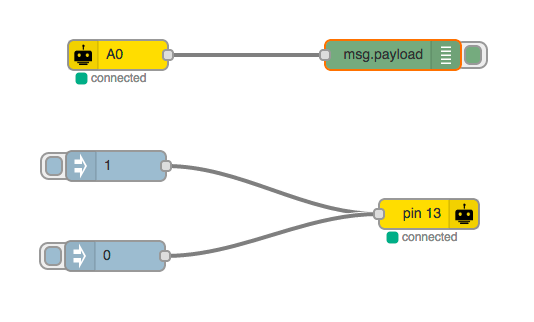

node-red-contrib-gpio
========================

A set of input and output nodes for controlling General Purpose Input and Outputs (GPIOs) though the use of [johnny-five](https://github.com/rwaldron/johnny-five) [I/O Plugins](https://github.com/rwaldron/johnny-five/wiki/IO-Plugins) as well as running johnny-five scripts!

## Install via NPM

From inside your node-red directory:
```
npm install node-red-contrib-gpio
```

## Control I/O for Analog, Digital, PWM and Servos



## Also Read and Write to i2c devices


## Now with full Johnny-five support!


## Supported Hardware

node-red-contrib-gpio supports several johnny-five I/O classes:

| Device | IO Plugin |
|----------|-------------|
|Arduino/Firmata|[firmata](https://github.com/jgautier/firmata)|
|Raspberry Pi|[raspi-io](https://github.com/bryan-m-hughes/raspi-io)|
|BeagleBone Black|[beaglebone-io](https://github.com/julianduque/beaglebone-io)|
|C.H.I.P.|[chip-io](https://github.com/sandeepmistry/node-chip-io)|
|Galileo/Edison|[galileo-io](https://github.com/rwaldron/galileo-io/)|
|Blend Micro|[blend-micro-io](https://github.com/noopkat/blend-micro-io)|
|LightBlue Bean|[bean-io](https://github.com/monteslu/bean-io/)|
|Electirc Imp|[imp-io](https://github.com/rwaldron/imp-io/)|
|Particle(Spark) Core|[particle-io](https://github.com/rwaldron/particle-io/)|


Arduino is supported out of the box, but for other devices, you'll need to install their IO plugin.

For example to install the Raspberry Pi plugin:

```
npm install raspi-io
```


## Remote Arduino Support

If you're using Arduino/Firmata, you can connect to a remote device via a raw tcp socket, or an MQTT connection.

For example, if you wanted to connect using tcp, in node-red you could specify an ip and port.  On another machine with an Arduino plugged in you could run a server that relays a tcp socket to a serial port such as: [tcpSerialRelay.js](https://gist.github.com/monteslu/b5ad4c46c9b6b78f7aea)

If you wanted to connect an Arduino to an MQTT server you can use a script such as: [bindSerialToMQTT.js](https://gist.github.com/monteslu/64372bcdff6f56458ec6).  In node-red you can connect to the same MQTT server and subscribe to the topic the arduino is publishing on, while publishing to the topic that the arduino is subscribed to.


